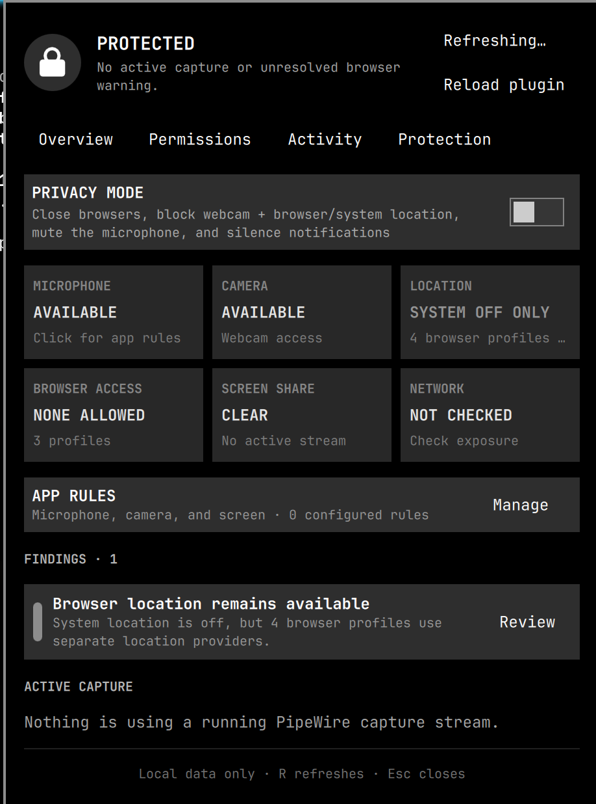
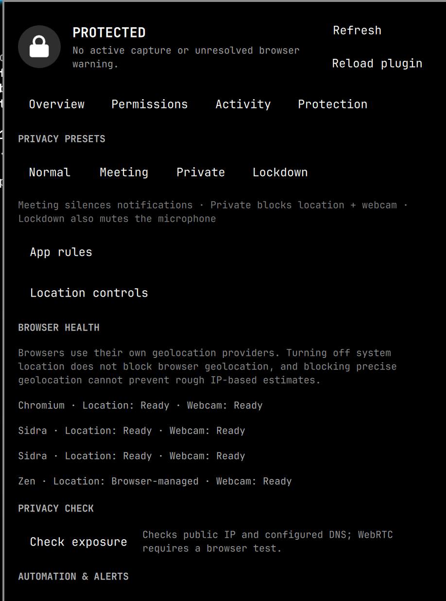
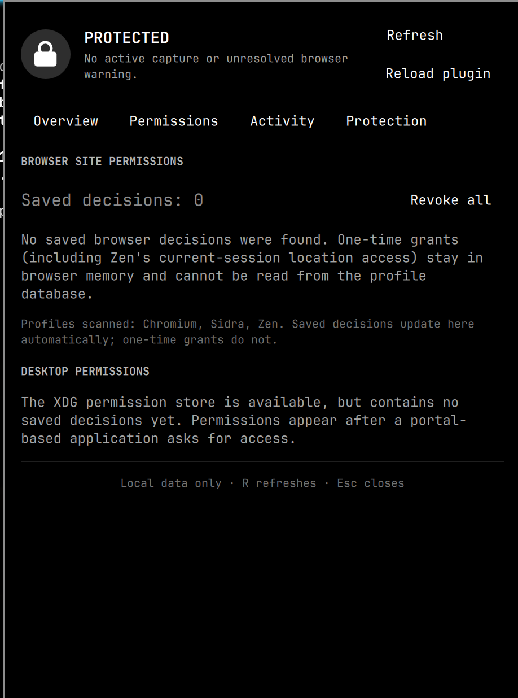

# OmaPrivacy

OmaPrivacy is a local privacy dashboard for the Omarchy Quattro shell. It
classifies active PipeWire capture streams, reads the XDG desktop Permission
Store directly, keeps a short local activity history, and provides guarded,
reversible privacy controls.

The panel uses four focused views—Overview, Permissions, Activity, and
Protection—with system-native cards, concise health language, activity
filters, and advanced details kept away from the primary status view.

The bar lock uses a one-shot mechanical open/close animation tied directly to
live capture state; it does not loop or pulse while a capture remains active.

## Screenshots

| Overview | Protection | Permissions |
| --- | --- | --- |
| [](docs/screenshots/overview.png) | [](docs/screenshots/protection.png) | [](docs/screenshots/permissions.png) |

## Current scope

- The lock indicator changes color while a PipeWire capture stream is active.
- Active streams are attributed to applications and classified as microphone,
  camera, or screen sharing from PipeWire metadata.
- Stored permissions are read directly from XDG Desktop Portal over the user
  session bus; Flatpak is not required.
- Persisted location, microphone, camera, and notification decisions are read
  from Chromium-family and Firefox-family browser profiles. Saved entries can
  be revoked after confirmation while the browser is closed; one-time and
  in-memory grants cannot be listed.
- Capture starts and stops are retained locally for seven days, capped at 200
  events, under `$XDG_STATE_HOME/omaprivacy`.
- Individual stored permissions can be revoked only after confirmation.
- Privacy Mode closes running browsers after explicit confirmation, saves and
  blocks Chromium-family and Firefox-family location and webcam settings, and
  also saves and changes microphone-mute, system-location, and Do Not Disturb states.
  Disabling it closes browsers again and restores all previous settings.
- Missing backends are reported in the panel instead of treated as a plugin
  failure.
- Browser Health summarizes location and webcam readiness for every discovered
  Chromium-, Firefox-, and Zen-family profile.
- System location and browser geolocation are reported separately; disabling
  the system service does not claim to block browser providers or rough
  IP-based location estimates.
- Browser Location Shield reversibly snapshots and blocks precise geolocation
  defaults and saved grants across supported browser profiles without changing
  webcam settings. Public-IP estimates remain explicitly outside its scope.
- Normal, Meeting, Private, and Lockdown presets apply progressively stronger,
  reversible protections.
- Capture transition alerts identify the application that starts using a
  microphone, camera, or screen stream.
- Per-app microphone, camera, and screen-sharing rules can retain the default
  alert behavior, always alert, or reactively stop a matching PipeWire capture
  stream without killing the application or affecting unrelated streams.
- Confirmed bulk cleanup revokes saved browser decisions after creating local
  profile backups.
- The seven-day privacy timeline includes capture, permission, preset, cleanup,
  and exposure-check activity.
- Privacy Check reports the public IPv4 address and configured DNS resolvers;
  WebRTC remains explicitly identified as requiring an in-browser test.
- Optional auto-rules can enter Lockdown on session lock or an untrusted Wi-Fi
  network. Networks become trusted only through the explicit Trust Current action.

PipeWire reports streams, not a security guarantee. Applications accessing a
device outside PipeWire may not appear. Classification and attribution depend
on metadata supplied by clients. Portal entries describe stored decisions;
they do not prove current use.

## Runtime requirements

- Python 3 with PyGObject (`gi`)
- PipeWire tools (`pw-dump`, `wpctl`)
- XDG Desktop Portal
- `omarchy-shell`

These are present in a standard Omarchy Quattro installation. Flatpak is not a
dependency.

## Install

Review the source, then install from its Git URL:

```bash
omarchy plugin add https://github.com/Daetrek/omaprivacy.git --enable
```

For local development, clone the repository and install that local Git checkout:

```bash
git clone https://github.com/Daetrek/omaprivacy.git
cd omaprivacy
omarchy plugin validate .
omarchy plugin add "$(pwd)" --enable --yes
```

The widget defaults to the right section of the bar. Saved QML changes under
the user plugin directory hot-reload automatically.

## Update

Git-managed installations update through Omarchy:

```bash
omarchy plugin update io.github.daetrek.omaprivacy
```

Existing settings and activity remain under `$XDG_STATE_HOME/omaprivacy`.
New configuration keys receive safe defaults automatically.

## Remove

Turn off Privacy Mode and Browser Location Shield first so OmaPrivacy can
restore every saved setting. Then remove the plugin:

```bash
omarchy plugin remove io.github.daetrek.omaprivacy
```

Removing the plugin does not delete its user-scoped history, configuration,
backups, or reversible-state files under `$XDG_STATE_HOME/omaprivacy`.

## Publishing

The permanent plugin ID is `io.github.daetrek.omaprivacy`. Marketplace plugin
IDs are permanent, so this ID must not be reused for an unrelated project.

## Safety model

Scanning and history are user-scoped. Permission revocation uses the XDG
Permission Store's `DeletePermission` method for exactly the confirmed table,
object, and application. Privacy Mode changes browser location and webcam
settings, the default microphone mute state, system location, and Omarchy Do
Not Disturb, and stores their prior values before acting.

Browser Location Shield uses a two-phase state file. If applying the shield is
interrupted, the Findings inbox reports recovery and the next enable attempt
restores the original snapshot before retrying. Auto-stop rules react only
after PipeWire exposes a matching stream; they are not kernel-level access
control. Browser profile edits require browsers to be closed.

## Known limitations

- Public IP addresses can reveal a rough region even when precise geolocation
  is blocked. Use a trusted VPN or proxy when IP-location privacy is required.
- One-time and in-memory browser grants cannot be enumerated from profile files.
- PipeWire metadata is client-supplied, so application attribution is useful
  evidence rather than a security boundary.
- Native applications that bypass PipeWire or the desktop portal are outside
  OmaPrivacy's visibility.
- Auto-stop is reactive; a stream may exist briefly before OmaPrivacy's next
  scan detects and destroys it.

## Verification

```bash
python -m unittest discover -s tests -v
python -m py_compile bin/omaprivacy
qmllint OmaPrivacy.qml
omarchy plugin validate .
git diff --check
```

See `TESTING.md` for the manual browser, capture, upgrade, and removal matrix.

## License

MIT
